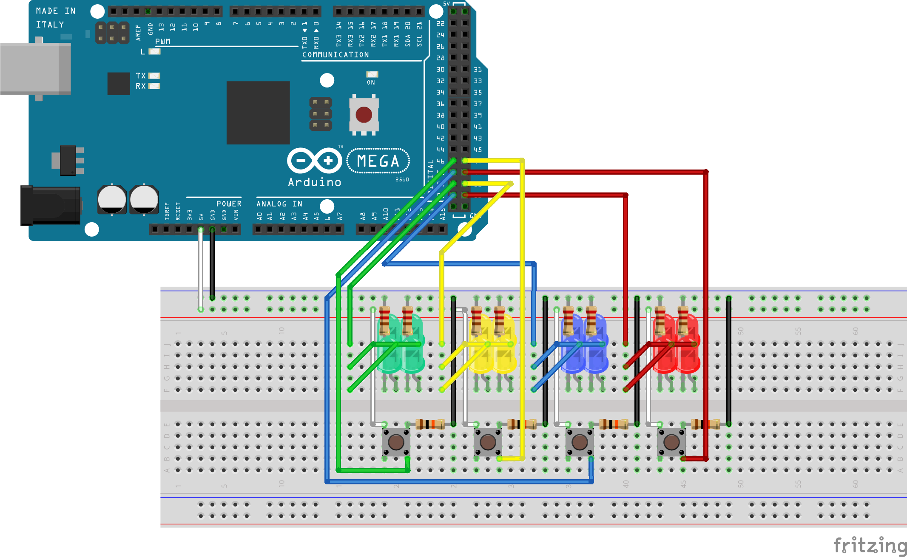
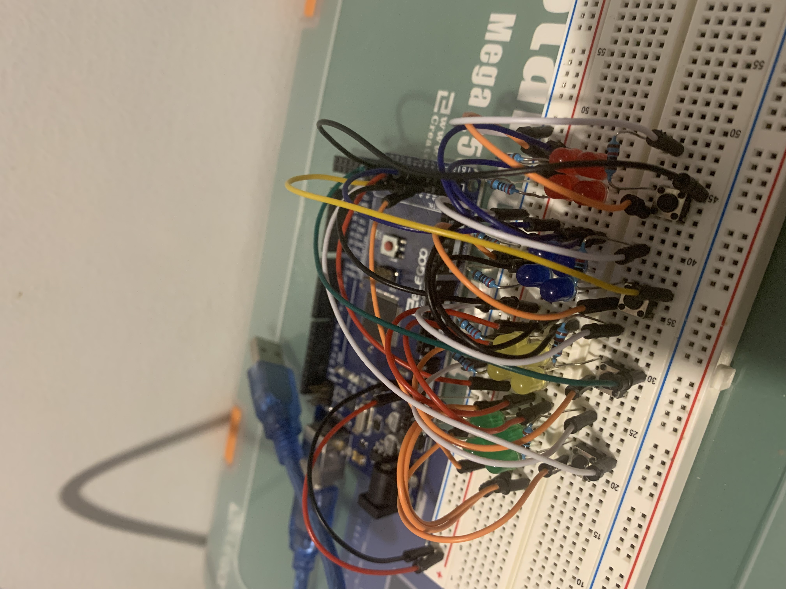
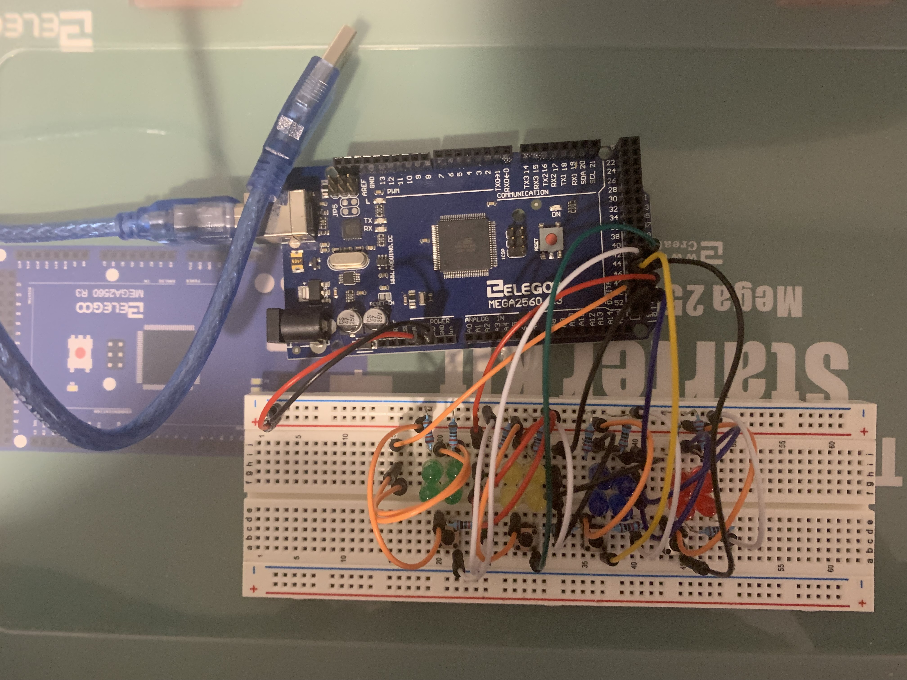
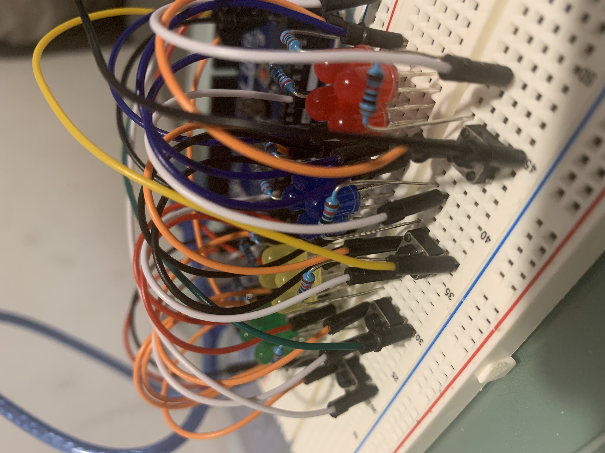
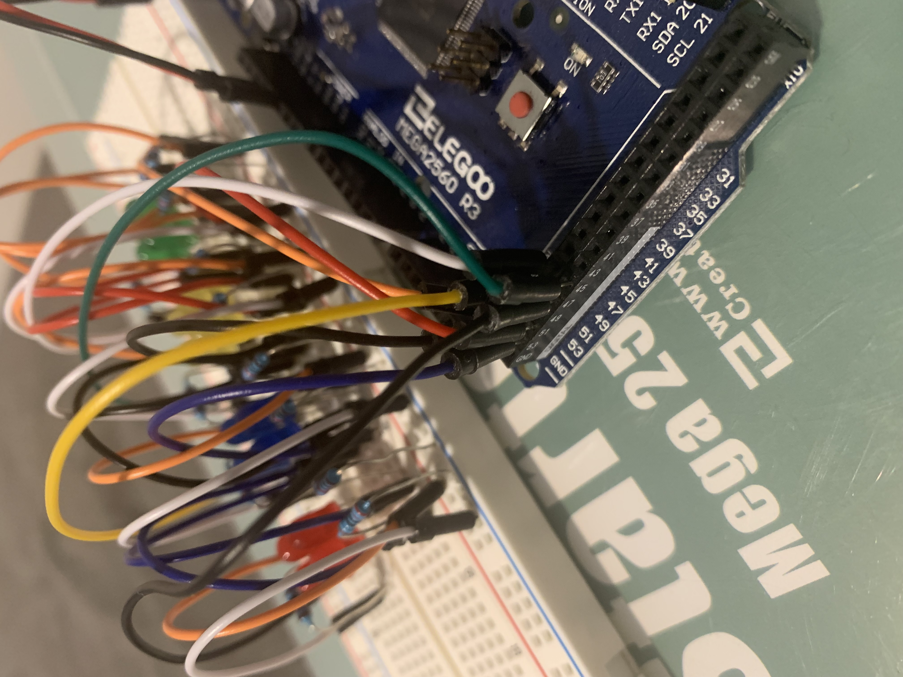

# Simon Says!

## Files
> [p1_blink.fzz](https://github.com/qusr08/IGME-470/blob/main/Blink/p1_blink.fzz): The Fritzing file for the circuit schematic

> [p1_blink.ino](https://github.com/qusr08/IGME-470/blob/main/Blink/p1_blink.ino): The Arduino code file for Simon Says

## My Goal
> For my project, I wanted to make my own Simon Says game. I believe that the experience I have created using my Arduino is reflective of what I set out to do.

## Demo Video
> [IGME-470 P1 Blink Demo](https://www.youtube.com/watch?v=p_PmPcwIEJs): A demonstration with some commentary about how my project functions

## How It's Done
> I started my project by figuring out how to wire everything together. I understand that I could have used one LED for each color to greatly simplify the wiring, but I liked the aesthetic more of having 4 for each color and wanted a bit of a challenge. In the end, I figured out how to hook up all four LEDs of one color to one digital output! This greatly simplified the programming, and I was able to do it in a way that uses fewer wires than if I were to hook all 16 of the LEDs to separate digital outputs. A schematic of the circuit is shown below. 

> For the programming, I used a state machine to determine which stage of the game the player was currently on. The state machine has three states: IDLE, SIMON, and PLAYER. The program starts in the IDLE state, where the LEDs flash in a cool pattern to indicate that a game has not started yet. The game is started as soon as one of the four buttons is pressed by the player, switching the state machine to SIMON. In the SIMON state, a new color is added to a list of colors that keep track of the pattern. The colors in this list are then displayed sequentially to the player by flashing the colored LEDs. Once the pattern has been told to the player, the state machine switches to the PLAYER state, where the player then has to use the buttons and repeat the pattern. If the player correctly enters the pattern, the state machine is switch back to SIMON and the pattern gets one color longer. If the player incorrectly enters a color, the correct color will then flash a couple of times to indicate that a mistake has been made (and that the flashing color was the correct color). The state machine then switches back to IDLE and waits for a new game to begin.

## Circuit Schematic

## Problems Encountered
> Wiring up four LEDs to one digital output was no easy task, and it took me a while to figure out how to do it. After experimenting for some time, I realized that I could hook two LEDs up to one digital input, but any more than that and the LEDs would not be able to shine at their full brightness. Eventually, I tried hooking up two of that setup together, and that worked to deliver enough power to the LEDs from one digital output. If I am being honest, I don't understand exactly why the LEDs are able to light up at full brightness with the way I have them set up. I just know that from my experimentation with the LEDs, this is the best possible solution to my problem that I could find.

> When tracking Simon's pattern in the programming, using an array was very challenging at first. I wanted the pattern to be reset after the player loses to allow for a new round to start with a new pattern. However, freeing the memory the array takes up and reallocating it in a new spot each time can be a little dangerous when dealing with such a small amount of memory. I wouldn't want any of the necessary functions of the Arduino or any of my other code to randomly stop working because of a faulty reallocation. I ended up just setting a constant size for the array (48 indices) and an integer to keep track of how big the pattern is within the game. This works fine, but if the player reaches a pattern size of 48 or more, either the game will break and the program will crash or other memory values will be overwritten by the pattern values. I figured it would be very rare to see someone get a 48 value long pattern correct, though, so I'm fairly certain the program should be fine. In the end, I've learned that C++ stinks.

## Resources
> [Fritzing](https://fritzing.org/): Used for making the schematic of the circuit

> [Arduino Project Hub](https://create.arduino.cc/projecthub): Used to better understand the wiring of Arduino components

## Photos Of Circuit

