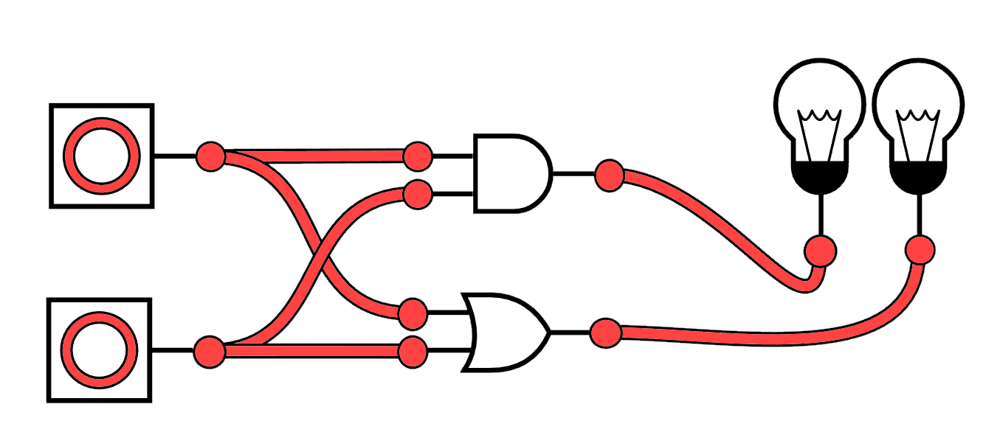
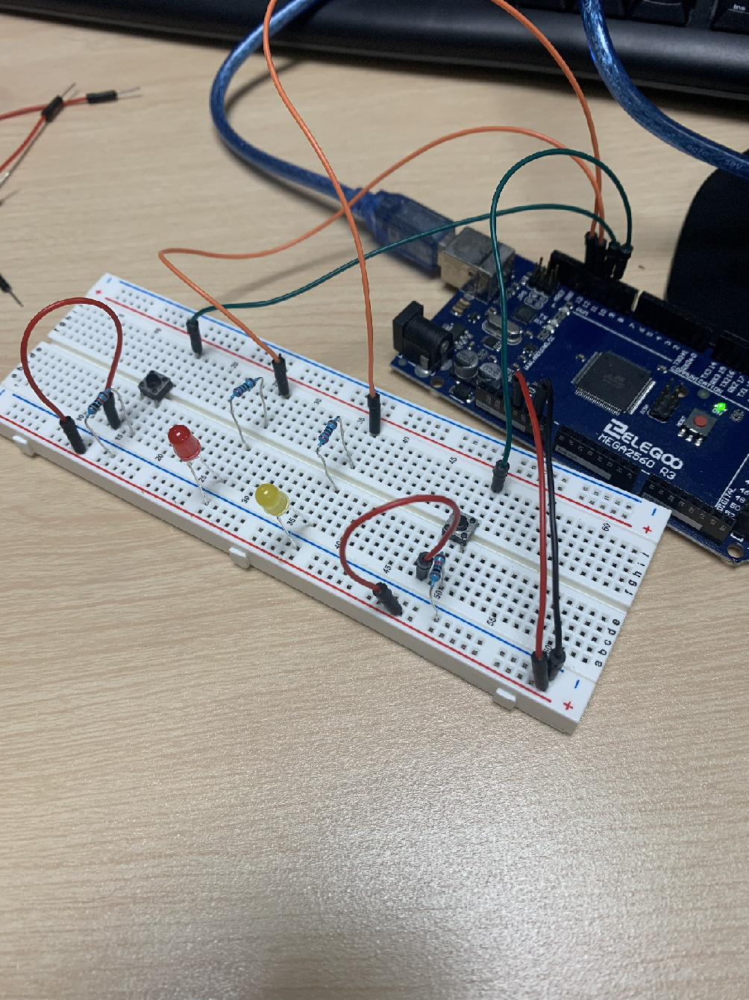

# Logic Gate LEDs

> For my circuit, I wanted to use logic gates to help light up my LEDs. I wanted to come up with something a little more interesting than just having the buttons directly connected to each LED and light them up that way. I had two different colored LEDs, red and yellow, to indicate the different logic gates. Both of the buttons were inputs, the red LED was hooked up to an OR gate, and the yellow LED was hooked up to an AND gate. If one or both of the buttons were pressed, the red LED would light up, and if both of the buttons were pressed, the yellow LED would light up. Very simple logic gates but interesting nonetheless. Below is a diagram of what the logic gates look like, where the pointed shape is the OR gate and the rounded shape is an AND gate.

> My code is very simple. It saves each button state to an integer (0 means not pressed, 1 means pressed), then the state of each LED is determined based on the sum of those integers. For example, if the sum of the button state integers is greater than 0, I know that at least one of the buttons is pressed (this is the logic I used for the OR gate) and the red LED should light up. Check out [moarr_digital.ino](https://github.com/qusr08/IGME-470/blob/main/Moarr%20Digital/moarr_digital.ino) for the code I used.

> I really did not have any issues making this, I am pretty familiar with how programming an Arduino goes and how to hook everything up. Below is a picture of the Arduino circuit that connects everything together for this assignment.

