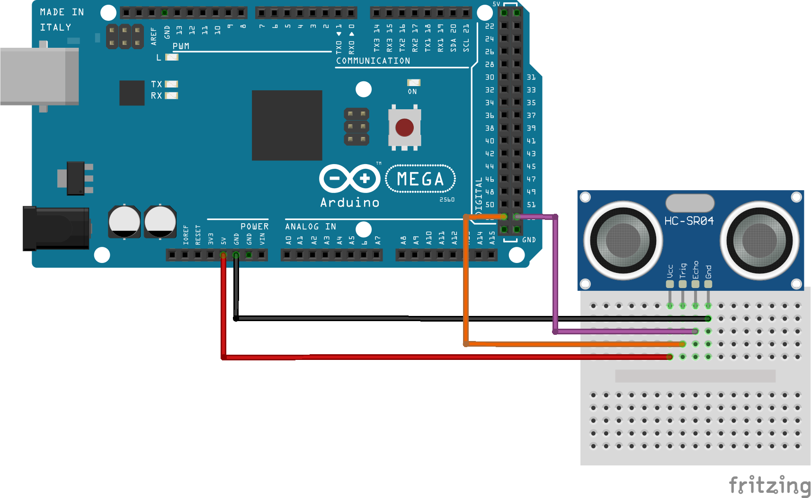

# The Human Touch

## Files
> [the_human_touch.fzz](https://github.com/qusr08/IGME-470/blob/main/Move/the_human_touch.fzz): The Fritzing file for the circuit schematic

> [the_human_touch.ino](https://github.com/qusr08/IGME-470/blob/main/Move/the_human_touch.ino): The Arduino code file for The Human Touch

> [The Human Touch](https://github.com/qusr08/IGME-470/tree/main/Move/The%20Human%20Touch): The Unity project for The Human Touch

## My Goal
> For my project, I wanted to make an experience that showed humans' impact on nature. The Human Touch turns water cascading in a waterfall to trash, demonstrating how easy and careless humans pollute our planet.

## Demo Video
> [IGME-470 P2 Move Demo](https://www.youtube.com/watch?v=-AzXC9cF9yw): A silent demonstration of what my project looks like and how it functions

## How It's Done
> I used Unity to display my desired effect and a distance sensor on an Arduino to add interactivity. As the user moves their hand closer and further away from the distance sensor, a collider I call "the human touch" in Unity mimics the movement and moves back and forth as well. The Arduino communicates only a single value to Unity, which is the distance sensor reading. The human touch interacts with falling "water droplets" in the form of cubes. When a water droplet intersects the human touch, it immediately turns to trash and is propelled away, knocking around the otherwise free-flowing water. Water droplets do not collide with other water droplets, and trash objects do not collide with other trash objects, but water droplets and trash objects collide with each other. This demonstrates that humans and nature are two separate systems that are battling for the same area. The human touch disrupts the waterfall, similarly to how humans disrupt nature. The mechanics behind the project are not incredibly complex, but I was definitely more focussed on the poetic message behind the project.

## Circuit Schematic

## Problems Encountered
> The largest problem I encountered was lag between data being collected by the Arduino and Unity receiving the data. If the Arduino was sending too much data at too fast of a rate, Unity wouldn't be able to keep up and it would lag behind, making the placement of the the human touch not responsive. In addition to that, I am spawning hundreds of objects in Unity to make the waterfall effect, which lags the game engine if not optimized. To fix the Unity problem, I made it so only certain objects collide with each other and tried to calculate as many values as I could beforehand so it wasn't taking up processing power as the game was running. To fix the Arduino problem, I slowed down the Arduino loop method by adding a delay function call. I'm still not sure if it is the best way to solve the problem, or if this solution will work on other faster computers than mine, but for the sake of showing the project it works just fine.

> A minor issue I also ran into was removing "faulty" values in the distance sensor. The distance sensor is not perfect and these faulty values would cause the human touch to move all over the screen spastically, making it not very responsive. To fix this I simply added a range check in the Arduino loop method that only sends a distance value that is inside a specified range. This way I can map the human touch to the width of my computer screen to have it look even more responsive than it was before!

## Resources
> [Fritzing](https://fritzing.org/): Used for making the schematic of the circuit

> [Arduino Project Hub](https://create.arduino.cc/projecthub): Used to better understand the wiring of Arduino components

> [SandW on Sketchfab](https://sketchfab.com/SandW): Made the 3D trash models

> [NuGet For Unity](https://github.com/GlitchEnzo/NuGetForUnity): Unity package to help with importing System.IO.Ports and allow for serial communication between the Arduino and Unity
