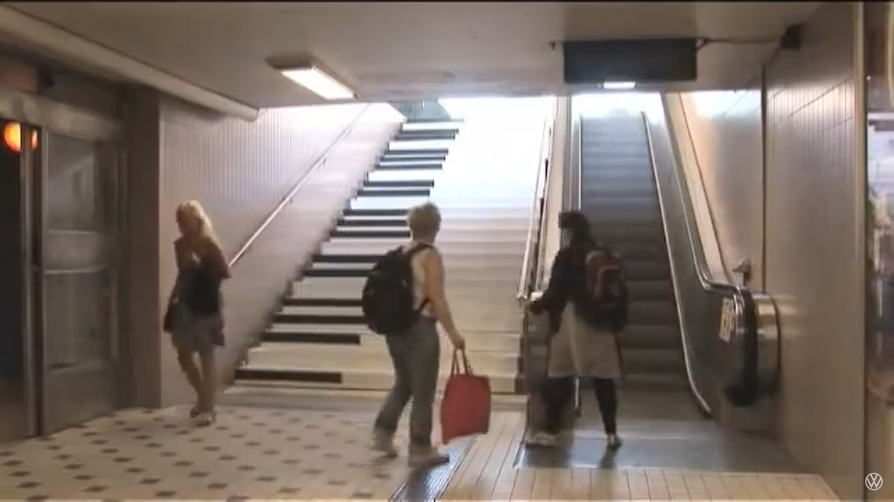
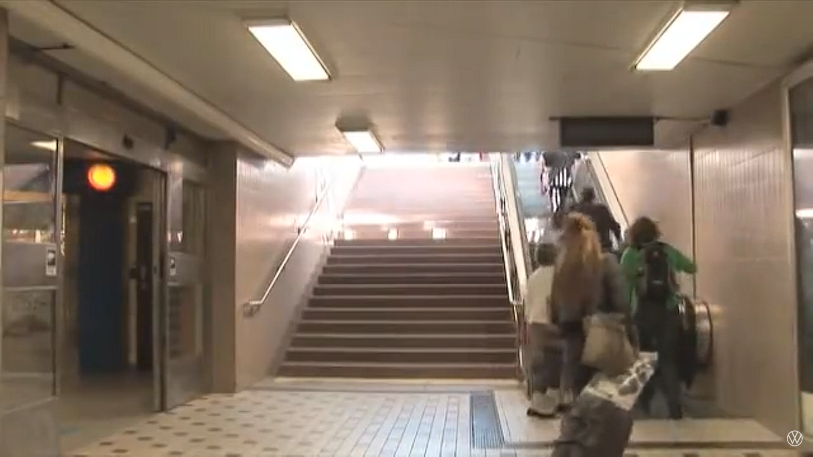
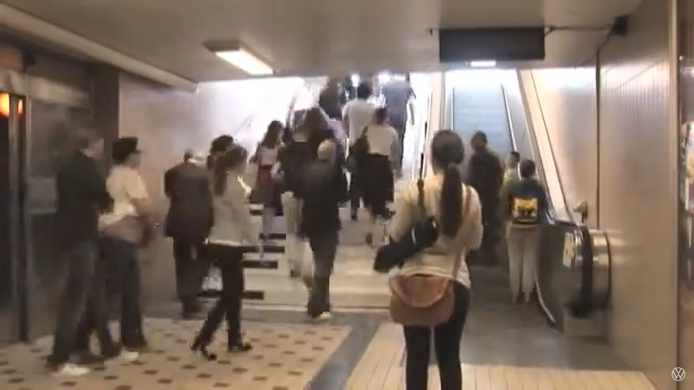

# Piano Staircase Initiative!

**Can we get more people to choose the stairs by making it fun to do?**

> This is the question that Volkswagen asked in an experiment for a new brand campaign they created in 2009 called The Fun Theory. People were met with a situation at the entrance to a subway station, where there was a set of stairs and an escalator next to each other. Almost every person that had to make the decision of which one to choose chose the escalator over the stairs. The people at Volkswagen wanted to figure out how to make the stairs more interesting to use to get people to not use the escalator, [so they decided to turn it into a working piano](https://www.youtube.com/watch?v=SByymar3bds). While there is no documentation on how the piano stairs were actually created, or at least no documentation that is still live on the internet, the mechanism does not seem too hard to decipher. I would image that there are pressure sensors on each stair that are connected to a buzzer that plays a certain note depending on which pressure sensor is active.

> The experiment is aimed at every age group of people who use the subway, and the station was in Stockholm, Sweden. The video of the experiment, however, was more for Volkswagen customers for a marketing campaign. A piano is a very basic interactive object that everyone including children know how to use, or could figure it out very quickly by interacting with it for a few seconds. People of all ages were seen playing on the stairs giving evidence that the experience created by the piano stairs is very fun.

> Overall, the experiment was to prove that by making an everyday task fun, more people will do it. Making stairs more interesting to walk up has a very significant effect on how many people walk up them. Volkswagen found that more than 66% of people used the piano stairs more than the regular stairs before.

### Before

### After

